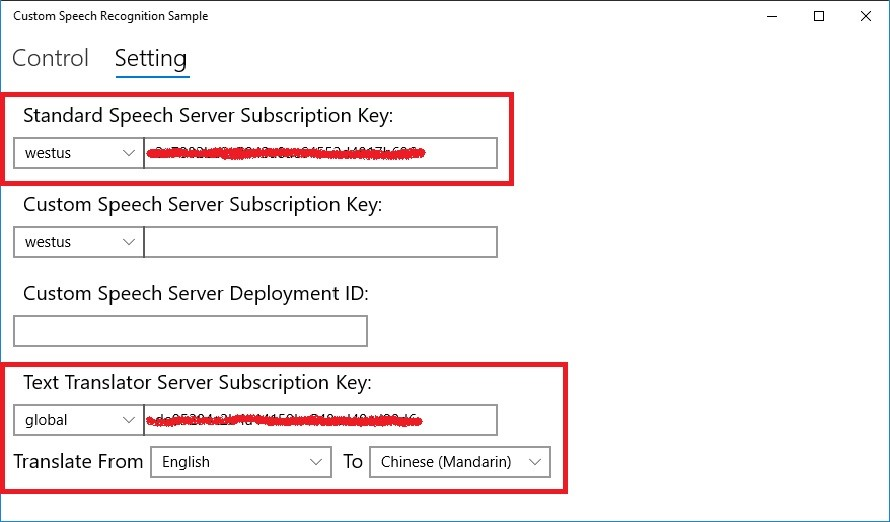
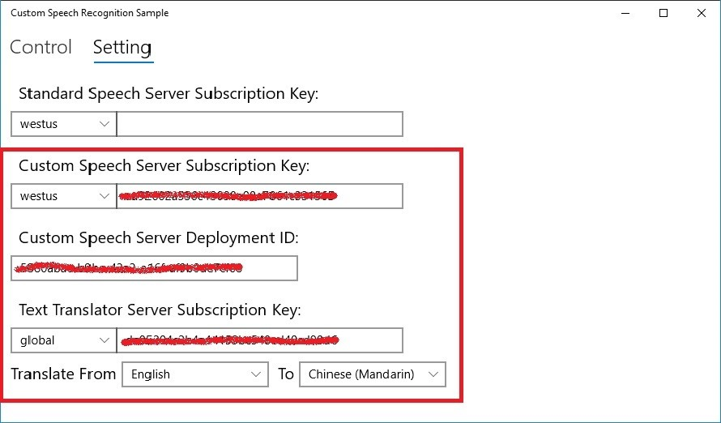
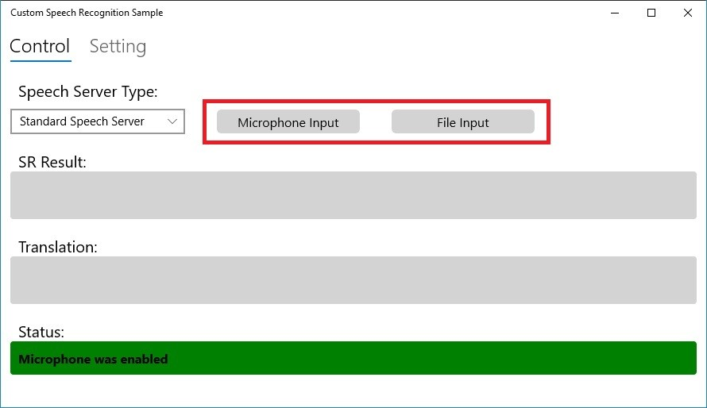

# The demo of using Custom Speech Service with Microsoft Translator to improve translation result

## Background
The Speech Translator Services can easily help to translate speech from one language to other languages. However, in some real scenarios of vertical industries, especially manufacturing industry, many domain specific vocabularies and abbreviations are often used with complex acoustic conditions. In these situations, general speech recognition and speech translator services aren’t able to meet the requirement of accuracy. Some specific vocabularies may be wrongly recognized and translated to other meanings. 

In this demo, we'll use Windows UWP App to show how we can use Custom Speech Model and Microsoft Translator to improve the Speech translation result for specific vocabularies and acoustic conditions. there are 4 objectives for this demo app: 

1. Help to quickly test your Custom Speech model
2. Help to understand how to use Custom Speech model with REST API and SDK
3. Compare the recognition result of regular speech model with your Custom Speech Model
4. Show how translation result can be improved by using Custom Speech Service with Microsoft Translator. 

## Prerequisites
* A subscription key for the Speech service. See [Try the speech service for free](https://docs.microsoft.com/azure/cognitive-services/speech-service/get-started).
* A Windows PC with Windows 10 Fall Creators Update (10.0; Build 16299) or later.
  Some sample scenarios require a working microphone.
* [Microsoft Visual Studio 2017](https://www.visualstudio.com/), Community Edition or higher.
* The **Universal Windows Platform development** workload in Visual Studio.
* Note: processor target ARM is not yet supported.
* Please build and deploy your Custom Speech Model via <a href="https://cris.ai" target="_blank"> Custom Speech Service Portal</a>
* If you don't have your Custom Speech Model, please refer to https://github.com/leonlj/CustomSpeechExample to build the model.
* Please make sure you have Microsoft Translator Text Service in Azure. If you haven't had, please refer to <a href=https://azure.microsoft.com/en-us/services/cognitive-services/translator-text-api/ target="_blank"> Translator Text Link </a>

## Build the sample

* **By building this sample you will download the Microsoft Cognitive Services Speech SDK. By downloading you acknowledge its license, see [Speech SDK license agreement](https://aka.ms/csspeech/license).**
* [Download the sample code to your development PC.](CustomSpeechWithTranslatorCode)
* Start Microsoft Visual Studio 2017 and select **File** \> **Open** \> **Project/Solution**.
* Navigate to the folder containing this sample, and select the solution file contained within it.
* Set the active solution configuration and platform to the desired values under **Build** \> **Configuration Manager**:
  * On a 64-bit Windows installation, choose `x64` as active solution platform.
  * On a 32-bit Windows installation, choose `x86` as active solution platform.
* Press Ctrl+Shift+B, or select **Build** \> **Build Solution**. 

## Run the sample

To debug the app and then run it, press F5 or use **Debug** \> **Start Debugging**. To run the app without debugging, press Ctrl+F5 or use **Debug** \> **Start Without Debugging**.

The app displays a graphical user interface (GUI).

* In the Settings page. please use two **Subscription Key** text fields to enter your subscription key of Speech Service and Text Translator Service.

* In the Settings page. please use **Custom Speech Subscription Key** text fields to enter your subscription key of Custom Speech Service, **and please input Deployment ID of your Custom Speech Model** (You can find it in Custom Speech Portal).

* In the drop down of each subscription, choose the region associated with your subscription.
* In the drop-down of translation, choose the target language for translating to.
* If you'd like to use your microphone, select **Enable Microphone**, which (first time you're clicking it) launches a permission prompt asking for microphone access.
  Approve it.
* In Control page, you can select use Microphone or existing audio file, and in drop-down, you can choose to use Standard Speech Service or Custom Speech Service with Microsoft Translator, comparing the result of two models.

> **Note:**
> if you are using your own `.wav` file as input source, make sure it is in the right format.
> Currently, the only supported `.wav` format is **mono (single-channel), 16 kHz sample rate, 16 bits per sample**.
